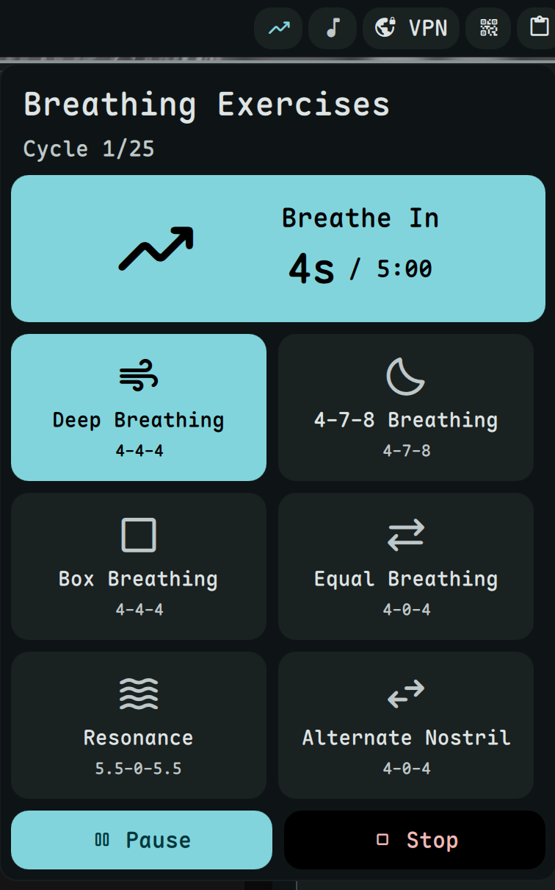

# Breathing Exercise

Guided breathing techniques for relaxation and focus.



## Install

[**Install Now**](dms://plugin/install/breathing)

Or manually:
```bash
git clone https://github.com/hthienloc/dms-breathing ~/.config/DankMaterialShell/plugins/breathing
```

## Features

- **6 techniques** - Deep Breathing, 4-7-8, Box, Equal, Resonance, Alternate Nostril
- **Visual guide** - Phase indicator shows inhale/hold/exhale
- **Duration presets** - Quick selection from 1m to 30m

## Usage

| Action | Result |
|--------|--------|
| Left click | Open exercise selector |
| Right click | Pause/resume |

## License

GPL-3.0